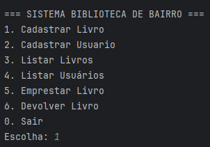
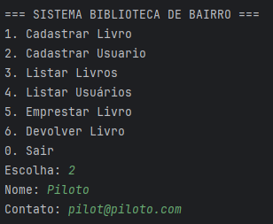
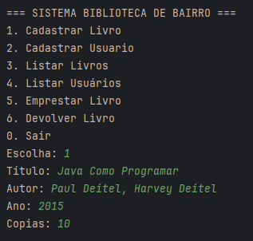
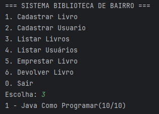
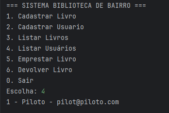
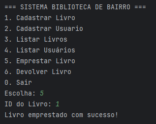
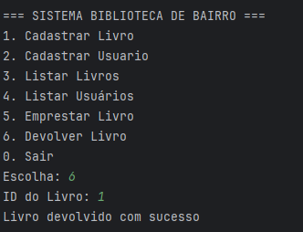
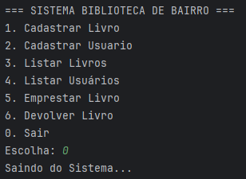

# 📚 Smart Library System (Java Edition)

A complete library management system developed in Java using Object-Oriented Programming, DAO architecture pattern and SQL persistence.

This project was created to simulate a real-world library management application, focusing on clean architecture, business rules, database integration and software engineering best practices.

---

# 🚀 Features

* User registration and management
* Book registration and catalog management
* Book loan system
* Return management
* SQL database persistence
* DAO Pattern architecture
* Organized layered structure
* Input validation and business rules

---

# 🛠️ Technologies Used

* Java
* JDBC
* SQL
* DAO Pattern
* Object-Oriented Programming (OOP)
* Git & GitHub

---

## 📁 Project Structure

```text
library-management-system-java/
│
├── assets/
│   ├── main-menu.png
│   ├── user-registration.png
│   ├── book-registration.png
│   ├── books-list.png
│   ├── user-list.png
│   ├── book-loan.png
│   ├── loan-service-of-system.png
│   └── exit-the-system.png
│
├── database/
│   └── schema.sql
│
├── libs/
│   └── mysql-connector-j.jar
│
├── src/
│   └── main/
│       └── java/
│           └── br/
│               └── com/
│                   └── cia/
│                       └── librarysystem/
│                           ├── dao/
│                           ├── database/
│                           ├── model/
│                           ├── service/
│                           └── Main.java
│
├── .gitignore
├── README.md
└── pom.xml
```
## ⚙️ Maven Configuration

This project uses Apache Maven for project structure and build configuration.

```xml
<groupId>br.com.cia.librarysystem</groupId>
<artifactId>library-management-system</artifactId>
<version>1.0.0</version>
```

### Java Version

```xml
<maven.compiler.source>21</maven.compiler.source>
<maven.compiler.target>21</maven.compiler.target>
```

---

# 🎯 Project Goals

This project was developed to improve skills in:

* Software Architecture
* Backend Development
* Database Integration
* Object-Oriented Design
* Layered Application Structure
* Version Control with Git

---

# ⚙️ Database Setup

Run the SQL script located in:

```text
database/schema.sql
```

before starting the application.

# 📸 Preview

> Screenshots and system previews.
## Main Menu



## User Registration



## Book Registration



## Books List



## Users List



## Book Loan



## Loan Service Of System



## Exit The System


---

# 📈 Future Improvements

* Better exception handling
* Automated testing
* Logging system
* Administrative dashboard
* REST API version
* Frontend integration
* Docker support

---

# 🔥 Evolution Roadmap

* [x] Java desktop version
* [x] SQL persistence
* [x] DAO architecture
* [ ] Python API version
* [ ] Modern backend architecture
* [ ] Frontend web interface
* [ ] Cloud deployment

---

# 🧠 Next Version

This project will also be rewritten in Python using modern backend technologies such as:

* FastAPI
* SQLAlchemy
* PostgreSQL
* REST APIs
* Layered Architecture

---

# 👨‍💻 Author

Developed by John Fernandes.

Focused on Backend Engineering & Software Architecture.